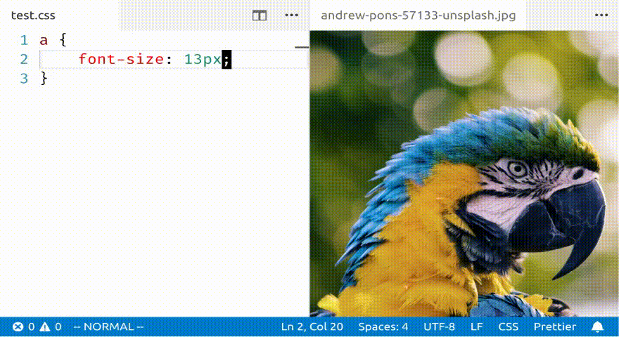

# vscode-xcolor

Pick any color on the screen and have the hexadecimal representation insert
into the currently active editor. This is a thin wrapper around the
[xcolor](https://github.com/Soft/xcolor) program.

## Features

## Usage

Once you have an editor open, you can trigger the `Pick screen color`
command. You should see a small preview window attached to your cursor, once
you selected a color, the hexcode will be inserted at the current position of
the cursor.

## Requirements

This extension requires you to have `xcolor` installed globally. See
https://github.com/Soft/xcolor for installation instructions.

Note that `xcolor` only supports linux systems running X11.